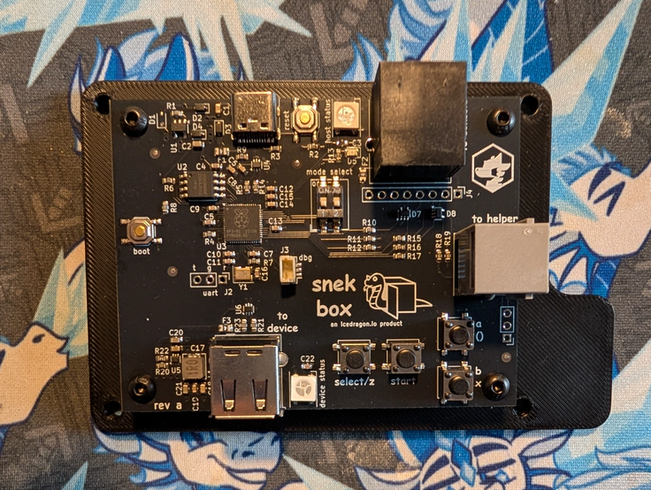

# snekbox: USB to Retro Console Adapter

Snekbox is a new USB to retro console adapter made specifically for high speed rhythm game use. It allows you to use new high quality USB rhythm and USB game controllers with older retro consoles such as the PlayStation, PlayStation 2, Original Xbox, GameCube, and Wii.

<p align="center">

</p>

# [click here to learn more and purchase!](https://icedragon.io/snek-box)

# adding new devices
New device requests are always welcome! Please make an issue ticket with a detailed report about the device you wish to add.

Please include as much information as possible including the USB VID/PID, the HID Report, and the button assignments.

If you have a new device working, feel free to submit a PR!

# flashing
Put the rp2040 into bootloader mode by connecting the type c port to your computer, holding the boot button, then pressing the reset button while the boot button is held.

There should now be flash drive you can drag the UF2 firmware file to.

# changing usb modes

Snek Box will remember what USB mode it was used last time. To change modes, hook the device up to a USB console or PC and hold the onboard "start" and  "a/o" buttons for five seconds. The device will cycle to the following modes indiciated by the rgb "host status" light.

| Mode          | Color  |
|---------------|--------|
| Original Xbox | Orange |
| Xbox 360      | Green  |
| PlayStation 3 | Blue   |

# supported target consoles
* Playstation 1/2
* Playstation 3
* GameCube/Wii
* Original Xbox
* Xbox 360

# supported host devices
* icedragon.io STAC & STAC2
* icedragon.io Snek Board (DDR, GF, DM)
* icedragon.io fusion-gamepad firmware for piuio
* StepManiaX
* LTEK
* Konami DDR GRAND PRIX Controller (BF110)
* Born to Lead (B2L)
* arduino key for fsr firmware
* Gamo2 PHOENIXWAN
* RedOctane X-Plorer
* Santroller based Guitars
* DFORCE Softmat
* DanceDanceRevolution Classic Mini
* HORI Taiko Drum Controller (for PS5, in PC mode)
* DualShock 3/4
* DualSense
* Switch Pro
* Xbox One (wired)
* Xbox 360 (wired)
* Xbox 360 USB Wireless adapter

# building
Ensure the rp2040 sdk is successfully installed and is available under `PICO_SDK_PATH`.

```
mkdir build
cd build
cmake ../
make all -j$(nproc)
```

# libraries and reference:
* [tinyusb](https://github.com/hathach/tinyusb)
* [Pico-PIO-USB](https://github.com/sekigon-gonnoc/Pico-PIO-USB)
* [pico_i2c_slave](https://github.com/vmilea/pico_i2c_slave)
* [pico-joybus-comms](https://github.com/JulienBernard3383279/pico-joybus-comms)
* [DS4toPS2](https://github.com/TonyMacDonald1995/DS4toPS2)
* [tusb_xinput](https://github.com/Ryzee119/tusb_xinput)
* [ogx360](https://github.com/Ryzee119/ogx360)
* [libxsm3](https://github.com/InvoxiPlayGames/libxsm3)